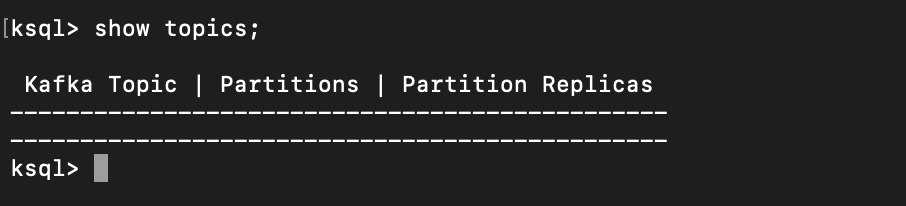
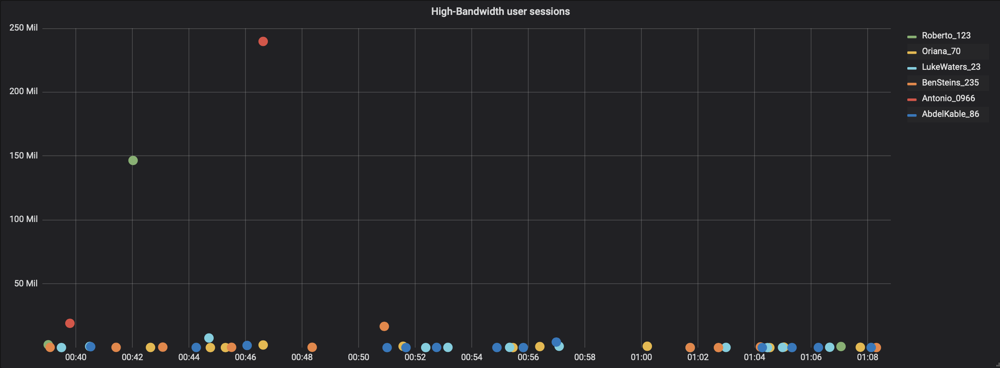

# Kafka Basics Homework
### Repository link https://github.com/MeriDm7/kafka-basics.git
# Overview

This example shows how KSQL can be used to process a stream of click data, aggregate and filter it, and join to information about the users.
Visualisation of the results is provided by Grafana, on top of data streamed to Elasticsearch. 

# Documentation

You can find the documentation for running this example and its accompanying tutorial at [https://docs.confluent.io/platform/current/tutorials/examples/clickstream/docs/index.html](https://docs.confluent.io/platform/current/tutorials/examples/clickstream/docs/index.html?utm_source=github&utm_medium=demo&utm_campaign=ch.examples_type.community_content.clickstream)


# Startup
### 1. Clone the repository.
### 2. Get the Jar files for `kafka-connect-datagen` (source connector) and `kafka-connect-elasticsearch` (sink connector).

```bash
docker run -v $PWD/confluent-hub-components:/share/confluent-hub-components confluentinc/ksqldb-server:0.8.0 confluent-hub install --no-prompt confluentinc/kafka-connect-datagen:0.4.0
docker run -v $PWD/confluent-hub-components:/share/confluent-hub-components confluentinc/ksqldb-server:0.8.0 confluent-hub install --no-prompt confluentinc/kafka-connect-elasticsearch:10.0.2
```


### 3. Start services.

```bash
docker-compose up -d
```


### 4. Check if the services have started.

```bash
docker-compose ps
```


# Create the Clickstream Data

### 1. Launch the ksqlDB CLI.

```bash
docker-compose exec ksqldb-cli ksql http://ksqldb-server:8088
```


### 2. Ensure the ksqlDB server is ready to receive requests by running the following until it succeeds.

```sql
show topics;
```




### 3. Run the script `create-connectors.sql` that executes the ksqlDB statements to create three source connectors for generating mock data.


```sql
RUN SCRIPT '/scripts/create-connectors.sql';
```


The `clickstream` generator is running, simulating the stream of clicks.

### 4. Sample the messages in the `clickstream` topic.

```sql
print clickstream limit 3;
```


### 5. Sample the messages in the `clickstream_codes` topic.

```sql
print clickstream_codes limit 3;
```


### 6. Sample the messages in the `clickstream_users` topic.

```sql
print clickstream_users limit 3;
```


### 7. Go to Confluent Control Center UI at http://localhost:9021 and view the three kafka-connect-datagen source connectors created with the ksqlDB CLI.


# Load the Streaming Data to ksqlDB

### 1. Create ksqldb sources based on kafka topics created previously.

To obtain bandwidth use metrics, add two new tables to the `statements.sql` file. The `BANDWIDTH_PER_MIN` table calculates the sum of bytes used by each user in 60 seconds. The `USER_SESSION_BANDWIDTH` table calculates the sum of bytes used in each user session.

```sql
CREATE TABLE BANDWIDTH_PER_MIN AS 
    SELECT
        username as K,
        AS_VALUE(username) as username,
        WINDOWSTART AS EVENT_TS, 
        SUM(bytes) AS total_bytes
    FROM USER_CLICKSTREAM 
    WINDOW TUMBLING (size 60 second)
    GROUP BY username; 

CREATE TABLE USER_SESSION_BANDWIDTH AS
    SELECT 
        username as K,
        AS_VALUE(username) as username,
        WINDOWSTART as EVENT_TS,
        SUM(bytes) AS total_bytes
    FROM USER_CLICKSTREAM
    WINDOW SESSION (30 second)
    GROUP BY username;
```

Load the `statements.sql` file

```sql
RUN SCRIPT '/scripts/statements.sql';
```


All statements executed successfully.

# Verify the data

### 1. Go to Confluent Control Center UI at http://localhost:9021, and view the ksqlDB view `Flow`.


### 2. Verify that data is being streamed through various tables and streams. Query one of the streams `CLICKSTREAM`.


# Load the Clickstream Data in Grafana

Send the ksqlDB tables to Elasticsearch and Grafana.

### 1. Set up the required Elasticsearch document mapping template.

```bash
docker-compose exec elasticsearch bash -c '/scripts/elastic-dynamic-template.sh'
```


### 2. Send the ksqlDB tables to Elasticsearch and Grafana.

Add new tables to `ksql-tables-to-grafana.sh` file.

Run:
```bash
docker-compose exec ksqldb-server bash -c '/scripts/ksql-tables-to-grafana.sh'
```


### 3. Load the dashboard into Grafana.

Add new tables to `ksql-tables-to-grafana.sh` file.

Run:
```bash
docker-compose exec grafana bash -c '/scripts/clickstream-analysis-dashboard.sh'
```


### 4. Navigate to the Grafana dashboard at http://localhost:3000. Enter the username and password as `user` and `user`. Then navigate to the `Clickstream Analysis Dashboard`.


### 5. In the Confluent Control Center UI at http://localhost:9021, again view the running connectors. The three kafka-connect-datagen source connectors were created with the ksqlDB CLI, and the seven Elasticsearch sink connectors were created with the ksqlDB REST API.


# Sessionize the data


### 1. Generate the session data.

```bash
./sessionize-data.sh
```


The dashboard:


# Real-time analytics 

## General website analytics, such as hit count and visitors

Create new graph using `events_per_min` table.


## Bandwidth use

Create new graph using `bandwidth_per_min` table.


## Mapping user-IP addresses to actual users and their location


## Detection of high-bandwidth user sessions

Create new graph using `user_session_bandwidth` table and set threshold to 500 MB. Also, create new table based on the same `user_session_bandwidth` 





## Error-code occurrence and enrichment


## Sessionization to track user-sessions and understand behavior (such as per-user-session-bandwidth, per-user-session-hits etc)


